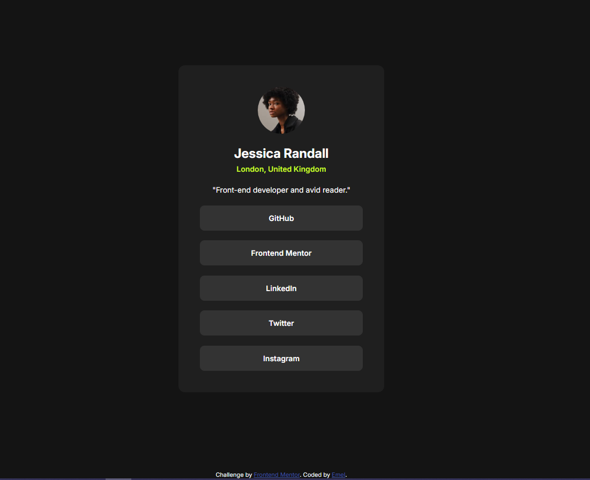

# Frontend Mentor - Social links profile


## Welcome! 👋

This is a solution to the [Social links profile challenge on Frontend Mentor](https://www.frontendmentor.io/challenges/social-links-profile-UG32l9m6dQ).  
Frontend Mentor challenges help you improve your coding skills by building realistic projects.

## Table of contents

- [Overview](#overview)
  - [The challenge](#the-challenge)
  - [Screenshot](#screenshot)
  - [Links](#links)
- [My process](#my-process)
  - [Built with](#built-with)
  - [What I learned](#what-i-learned)
  - [Useful resources](#useful-resources)
- [Author](#author)

---

## Overview

### The challenge

Users should be able to:

- See hover and focus states for all interactive elements on the page

### Screenshot



### Links

- Live Site URL: [Social links profile](https://emelinur.github.io/social-links-profile-main/)

---

## My process

### Built with

- Semantic HTML5 markup  
- CSS Custom Properties (design tokens for colors, spacing, typography)  
- HSL color system  
- Flexbox  
- Mobile-first workflow  
- Responsive sizing with `clamp()`, `calc()`, `vw` (no `@media` needed) 
- @media (prefers-reduced-motion: reduce)
---
### What I learned

- How to create fluid spacing and font sizes with `clamp()`:

```css
:root {
  --space-500: clamp(1.5rem, 1.5rem + 1.5vw, 2.5rem); /* 24 → 40px */
}
```
- How to make animations accessible using prefers-reduced-motion:
```css
@media (prefers-reduced-motion: reduce) {
  .button {
    transition: none; /* Disable transitions for users who prefer reduced motion */
  }
}
```
---
### Useful resources

 [MDN – clamp()](https://developer.mozilla.org/en-US/docs/Web/CSS/clamp)

[W3Schools–CSS functions](https://www.w3schools.com/cssref/css_functions.php)

Frontend Mentor challenges

AI tools for explanation and refactoring support

---

## Author
- Frontend Mentor - [@Emelinur](https://www.frontendmentor.io/profile/Emelinur)
- Github - [@Emelinur](https://github.com/Emelinur)